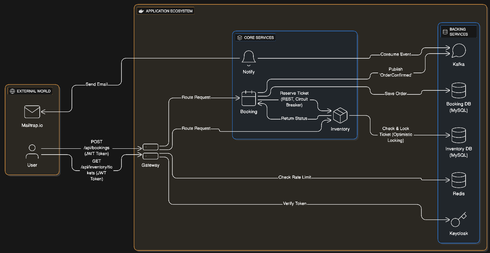

# **Ticket Booking Microservices**

This project is a complete, industry-grade ticket booking application built using a Spring Boot microservices architecture. It serves as a deep dive into the principles and challenges of building modern, distributed, cloud-native systems.

The core goal was to simulate a real-world system with high-concurrency demands (e.g., many users trying to book the same ticket) and build it with resilience, security, and scalability in mind.

## Architecture Diagram:



## Project Learnings & Key Features:

This project was an exercise in building a complete system, not just individual services. Here are the core concepts explored:

### Concurrency & Data Integrity:

Challenge: How to handle two users trying to book the exact same ticket at the same millisecond?

Solution: Implemented Optimistic Locking using @Version in the Inventory Service. If two requests come in, the first one increments the version and succeeds. The second request, which has the old version number, fails with an ObjectOptimisticLockingFailureException. The Booking Service catches this (409 Conflict) and informs the user to "try another seat," preventing data corruption without the performance hit of pessimistic locking.

### Security & Identity:

Challenge: How to secure the entire microservice ecosystem?

Solution: Integrated Keycloak as a central identity provider. The API Gateway acts as an OAuth2 ResourceServer, validating a JWT from the user on every request. This keeps the downstream services (Booking, Inventory) simple, as they just trust requests coming from the gateway.

### Resilience & Fault Tolerance:

Challenge: What happens if the Inventory Service is slow or goes down?

Solution: Implemented the Circuit Breaker pattern using Resilience4j in the Booking Service. If the Inventory Service fails repeatedly, the circuit opens, and the Booking Service will "fail fast" with a fallbackMethod, telling the user "Booking is temporarily unavailable" instead of hanging and crashing the system (cascading failure).

### Decoupling with Asynchronous Communication:

Challenge: Sending an email can be slow. If the email server is down, should the user's booking fail?

Solution: No. The Booking Service's only job is to confirm the booking. Once confirmed, it publishes an OrderConfirmationDto message to a Kafka topic. The Notification Service, a completely separate consumer, picks up this message and handles the email. If the Notification Service fails, the message is retried in Kafka, but the user's booking is already complete and unaffected.

### Centralized Entry Point & API Management:

Challenge: How to protect services from abuse and provide a single, simple URL for clients?

Solution: The API Gateway handles all routing. It also uses a Redis-backed Rate Limiter to throttle requests on a per-user basis (identified by their JWT), preventing a single user from overwhelming the system.

### Database Schema as Code:

Challenge: How to ensure the database schema is in sync with the application code, especially in microservices where each service has its own DB?

Solution: Used Flyway in both the Booking Service and Inventory Service. The SQL migration scripts are bundled with the application, so when the service starts, Flyway checks the DB, applies any new migrations, and ensures the code and schema always match.


## Getting Started (Local Development):

This section details how to run the entire system on a local machine for development and testing.

#### Prerequisites-

Git

Java 17 (or higher) & Maven

Docker & Docker Compose

A Mailtrap.io account (for testing email notifications)

##### 1. Clone the Repository
```
git clone [https://github.com/your-username/ticket-booking-system.git](https://github.com/your-username/ticket-booking-system.git)
cd ticket-booking-system
```

#### 2. Configure Environment

You must provide your Mailtrap credentials.

Open notification-service/src/main/resources/application.properties.

Find and replace <your_mailtrap_username> and <your_mailtrap_password> with your credentials from your Mailtrap SMTP inbox.

#### 3. Build and Run with Docker Compose

This single command builds all 4 service images and starts all containers.
```
docker-compose build
docker-compose up
```

The system is now running. It may take a minute for all services to start.

#### 4. How to Test the Full Booking Flow

Use Postman or a similar tool to simulate a client application.

##### Step 1: Get an Authentication Token from Keycloak

Send a POST request to http://localhost:8180/realms/ticket-booking-realm/protocol/openid-connect/token with the body as x-www-form-urlencoded:

client_id: api-gateway-client

client_secret: your-client-secret

grant_type: password

username: testuser

password: password

Copy the access_token from the JSON response.

##### Step 2: Make a Booking Request (via API Gateway)

Create a new POST request to the API Gateway's booking endpoint:

POST http://localhost:8080/api/bookings

Headers:

Authorization: Bearer <paste_your_access_token_here>

Content-Type: application/json

Body:

{
"customerId": 1,
"ticketId": 1
}


(Note: Sample data is pre-loaded by Flyway and CommandLineRunners)

##### Step 3: Check the Results

**Response:** You should get a 200 OK response with the confirmed CONFIRMED order details.

**Logs:** Check the logs (docker-compose logs -f). You'll see the entire flow.

**Mailtrap:** Open your Mailtrap inbox. You will see the booking confirmation email.

**Database:** Connect to MySQL at localhost:3306 (root/password). Check the inventory_db.tickets and booking_db.booking_orders tables to see the changes.
